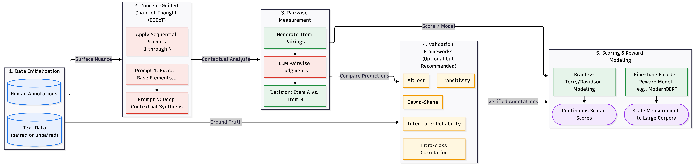

# pairadigm: A Python Library for Concept-Guided Chain-of-Thought Pairwise Measurement of Scalar Constructs Using Large Language Models

`pairadigm` is a Python library designed to streamline the creation of high-quality, continuous measurement scales from text using LLMs. It implements a **Concept-Guided Chain-of-Thought (CGCoT)** methodology to surface nuance in text and then generate reasoned **pairwise comparisons** using LLMs, including Google Gemini, OpenAI GPTs, Anthropic Claude, and downloadable local models via Ollama and Huggingface. It then can **evaluate and validate** LLM annotations using a small sample of manual annotations and - once validated - can then scale up to generate pairwise comparisons for larger samples of the data. Lastly, it has built in functionality to model the latent construct from these comparisons using a Bradley-Terry model to convert them into **continuous scores** and provides a pipeline to fine-tune encoder-based reward models (e.g., ModernBERT) for scaling measurement to other datasets.

You can see an example of the package in use in the `v1_example.ipynb` and `validation_example.ipynb` notebooks. The most recent changes are detailed at the bottom of this page and in the `CHANGELOG.md` file. 



[](https://doi.org/10.5281/zenodo.17981011)

## Installation

### Prerequisites

- Python 3.8+
- API keys for your chosen LLM provider(s)

### Setup

In the **terminal**, follow these steps:
1. Install the package:
```bash
# For development version
# pip install git+https://github.com/mlchrzan/pairadigm.git

# For latest stable release 
pip install pairadigm
```

2. Set up environment variables(e.g. API keys):
```bash
# Create a .env file in the project root
touch .env

# Add your API key(s) - choose based on your LLM provider
echo "GENAI_API_KEY=your_google_api_key_here" >> .env
# OR
echo "OPENAI_API_KEY=your_openai_api_key_here" >> .env
# OR
echo "ANTHROPIC_API_KEY=your_anthropic_api_key_here" >> .env
```

## Quick Start

Below are the basic workflows for using the package. You can find a full example of this in the jupyter notebook `v1_example.ipynb`.

### Basic Workflow: Unpaired Items

```python
import pandas as pd
from pairadigm import Pairadigm

# Load your data
df = pd.DataFrame({
    'id': ['item1', 'item2', 'item3'],
    'text': ['Text content 1', 'Text content 2', 'Text content 3']
})

# Define CGCoT prompts for your concept
cgcot_prompts = [
    "Analyze the following text for objectivity: {text}",
    "Based on the previous analysis: {previous_answers}\nIdentify any subjective language."
]

# Initialize Pairadigm
p = Pairadigm(
    data=df,
    item_id_name='id',
    text_name='text',
    cgcot_prompts=cgcot_prompts,
    model_name='gemini-2.0-flash-exp',
    target_concept='objectivity'
)

# Generate CGCoT breakdowns
p.generate_breakdowns(max_workers=4)

# Create pairings
p.generate_pairings(num_pairs_per_item=5, make_splits=True, breakdowns=True)

# Generate pairwise annotations
p.generate_pairwise_annotations()

# Compute Bradley-Terry scores
scored_df = p.score_items(normalization_scale=(0,1))

# Visualize results
p.plot_score_distribution()
p.plot_comparison_network()
```

### Using Multiple LLMs

```python
# Initialize with multiple models
p = Pairadigm(
    data=df,
    item_id_name='id',
    text_name='text',
    cgcot_prompts=cgcot_prompts,
    model_name=['gemini-2.0-flash-exp', 'gpt-4o', 'claude-sonnet-4'],
    api_keys=[
        'your_google_api_key_here',
        'your_openai_api_key_here',
        'your_anthropic_api_key_here'
    ],
    target_concept='objectivity'
)

# View available clients
print(p.get_clients_info())

# Generate breakdowns with all models
p.generate_breakdowns()

# Generate annotations with all models
p.generate_pairwise_annotations()

# Score items for each model
scored_df_gemini = p.score_items(decision_col='decision_gemini-2.0-flash-exp')
scored_df_gpt = p.score_items(decision_col='decision_gpt-4o')
scored_df_claude = p.score_items(decision_col='decision_claude-sonnet-4')
```

### Working with Pre-Paired Data

```python
# Data with pre-existing pairs
paired_df = pd.DataFrame({
    'item1_id': ['a', 'b', 'c'],
    'item2_id': ['b', 'c', 'a'],
    'item1_text': ['Text A', 'Text B', 'Text C'],
    'item2_text': ['Text B', 'Text C', 'Text A']
})

p = Pairadigm(
    data=paired_df,
    paired=True,
    item_id_cols=['item1_id', 'item2_id'],
    item_text_cols=['item1_text', 'item2_text'],
    cgcot_prompts=cgcot_prompts,
    target_concept='political_bias'
)

# Generate breakdowns for paired items
p.generate_breakdowns()

# Continue with annotations and scoring...
p.generate_pairwise_annotations()
p.score_items(normalization_scale=(0,1))
```

### Adding Human Annotations

```python
# Create human annotation data
human_anns = pd.DataFrame({
    'item1': ['id1', 'id2'],
    'item2': ['id2', 'id3'],
    'annotator1': ['Text1', 'Text2'],
    'annotator2': ['Text2', 'Text1']
})

# Add to existing Pairadigm object
p.append_human_annotations(
    annotations=human_anns,
    decision_cols=['annotator1', 'annotator2']
)

# Or load from file
p.append_human_annotations(
    annotations='human_annotations.csv',
    annotator_names=['expert1', 'expert2']
)
```

### Validating Against Human Annotations

```python
# Data with human annotations
annotated_df = pd.DataFrame({
    'item1': ['a', 'b'],
    'item2': ['b', 'c'],
    'item1_text': ['Text A', 'Text B'],
    'item2_text': ['Text B', 'Text C'],
    'human1': ['Text1', 'Text2'],  # Human annotator choices
    'human2': ['Text1', 'Text1']
})

p = Pairadigm(
    data=annotated_df,
    paired=True,
    annotated=True,
    item_id_cols=['item1', 'item2'],
    item_text_cols=['item1_text', 'item2_text'],
    annotator_cols=['human1', 'human2'],
    cgcot_prompts=cgcot_prompts,
    target_concept='sentiment'
)

# Run LLM annotations
p.generate_breakdowns()
p.generate_pairwise_annotations()

# Examine classic metrics
transitivity_results = p.check_transitivity()
for annotator, (score, violations, total) in transitivity_results.items():
    print(f"{annotator}: {score:.2%} transitivity ({violations}/{total} violations)")

irr_results = p.irr(method='auto')
print(irr_results)

p.icc()

# Validate using AltTest
winning_rate, advantage_prob = p.alt_test(
    scoring_function='accuracy',
    epsilon=0.1,
    q_fdr=0.05
)

print(f"LLM winning rate: {winning_rate:.2%}")
print(f"Advantage probability: {advantage_prob:.2%}")

# Test all LLMs at once (if using multiple models)
results = p.alt_test(test_all_llms=True)
for model_name, (win_rate, adv_prob) in results.items():
    print(f"{model_name}: Win Rate={win_rate:.2%}, Advantage={adv_prob:.2%}")

# Examine annotator construct sensitivity using Dawid-Skene
p.dawid_skene_annotator_ranking()
```

## CGCoT Prompts

CGCoT prompts are the backbone of Pairadigm's analysis. Design them to progressively analyze your target concept (see the `v1_example.ipynb` for more info).

### Loading Prompts from File

```python
# prompts.txt format:
# What factual claims are made in this text? {text}
# Based on: {text} Are these claims supported by evidence?
# Does the language show emotional bias?

p.set_cgcot_prompts('prompts.txt')
```
WARNING: If loading .txt files into CGCOT Prompts, ensure the .txt files do NOT have double spaces as these will be interpreted as an additional prompt.

### Best Practices

1. **First prompt**: Identify relevant elements using `{text}` placeholder
2. **Middle prompts**: Build on `{previous_answers}` to deepen analysis
3. **Final prompt**: Synthesize findings related to target concept
4. Keep prompts focused and sequential

## Advanced Features

### Save and Load Analysis

```python
# Save your analysis
p.save('my_analysis.pkl')

# Load it later
from pairadigm.core import load_pairadigm
p = load_pairadigm('my_analysis.pkl')
```

### Estimating API Costs

```python
# Estimate token limits and API costs before running large jobs
cost_estimates = p.estimate_costs()
print(cost_estimates)
```

### Fine-Tuning a Reward Model

```python
from pairadigm.model import RewardModel

# Prepare training data from pairwise comparisons
training_pairs = [
    ("Text with high score", "Text with low score", 1.0),
    ("Better text", "Worse text", 1.0),
    # ... more pairs
]

# Initialize and train reward model
reward_model = RewardModel(
    model_name="answerdotai/ModernBERT-base",
    dropout=0.1,
    max_length=384
)

train_loader = reward_model.prepare_data(training_pairs, batch_size=16)
reward_model.train(train_loader, epochs=3, learning_rate=2e-5)

# Score new texts
score = reward_model.score_text("New text to evaluate")
scores = reward_model.score_batch(["Text 1", "Text 2", "Text 3"])

# Normalize scores to desired scale (e.g., 1-9)
normalized = reward_model.normalize_scores(scores, scale_min=1.0, scale_max=9.0)

# Save trained model
reward_model.save('my_reward_model.pt')

# Load later
reward_model.load('my_reward_model.pt')
```

### Rate Limiting

```python
# Limit API calls to 10 per minute
p.generate_breakdowns(
    max_workers=4,
    rate_limit_per_minute=10
)
```

### Custom Scoring Functions

```python
def custom_similarity(pred, annotations):
    # Your custom scoring logic
    return score

winning_rate, advantage_prob = p.alt_test(
    scoring_function=custom_similarity
)
```

## Citation

If you use this version of `pairadigm` in your research, please cite:

```bibtex
@software{pairadigm2026,
  author = {Chrzan, M.L.},
  title = {pairadigm: A Python Library for Concept-Guided Chain-of-Thought Pairwise Measurement of Scalar Constructs Using Large Language Models},
  year = {2026},
  month = {April},
  version = {1.0.1},
  url = {https://github.com/mlchrzan/pairadigm}
}
```

For citing previous versions, see the package's PyPI page and history.

## License

Apache 2.0 License

## Contributing

Contributions are welcome! Please review the [CONTRIBUTING.md](CONTRIBUTING.md) file for more information.

## Support

For questions and issues:
- Open an issue on GitHub
- Check the example notebooks in the repository
- Review the docstrings 

## Potential Features
- Performance improvement for multiple models by parallelizing API calls across models, not just within models
- Enhanced validation metrics and visualizations (IN PROGRESS, recommendations welcome!)
    - Improved inter-rater reliability visualizations
    - Item evaluation metrics and visualizations 
- Dawid-Skene item ground truth estimation with and without LLM annotators (NOT STARTED)
- Updated score_items to use the Dawid-Skene estimated ground truth (NOT STARTED)
- Update Dawid-Skene methods to generate multiple runs to examine stability (for now, we recommend examining variance independently over multiple seeds)
- Support for multiple concepts simultaneously (NOT STARTED)

# Previous Updates (see CHANGELOG.md for all)

## [1.0.1] - 2026-04-18
### Updated
- **Robust Davidson Scoring**: Replaced the unstable iterative approach for estimating Davidson scores with a mathematically robust optimization method (`scipy.optimize.minimize`).
- **Reward Model Integrations**: Improved dynamic column fallback in `RewardModel.prepare_data()` to seamlessly support Davidson scores when present.

### Fixed
- **F-string Syntax Error**: Fixed an invalid string formulation containing literal backslashes inside an f-string evaluated in `pair_from_ordinal()`. 

## [1.0.0] - 2026-04-16 - 'Summer Body'
### Added
- **Safer Saving Logic**: Instead of using pickles, `pairadigm` now saves and loads data using individual parquet files, which are more robust and efficient. This also means that `pairadigm` objects are now much smaller and faster to load. It also saves the instance construction parameters in a `metadata.json` file, which is used to reconstruct the object when loading.
- **LLM API Cost Estimation**: Added `estimate_costs()` method to calculate token/cost usage via `tiktoken`.
- **Client Addition Workflows**: Incrementally process new LLM clients added to an existing dataset.
- **Dawid-Skene Enhancements**: Return confusion matrices alongside ranking metrics; warnings for 3-class ties.

### Updated
- **Unified Breakdowns**: Consolidated breakdown generation into a single robust `generate_breakdowns()` method.
- **Module-Level Ordinal Logic**: Multi-annotator ordinal evaluations moved to the module level.
- **Documentation**: Overhauled `core.py` docstrings with full researcher-friendly examples.

### Fixed
- Assorted data constraints, duplicate `kwargs`, and sparse dataset bugs across the AltTest and validation components.